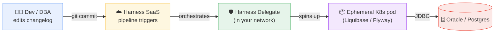
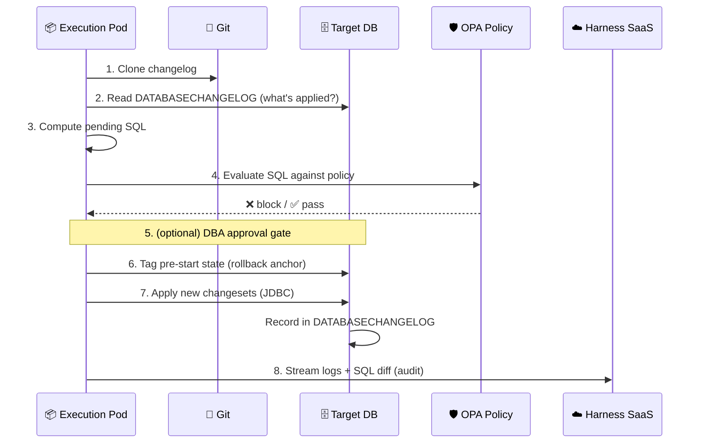
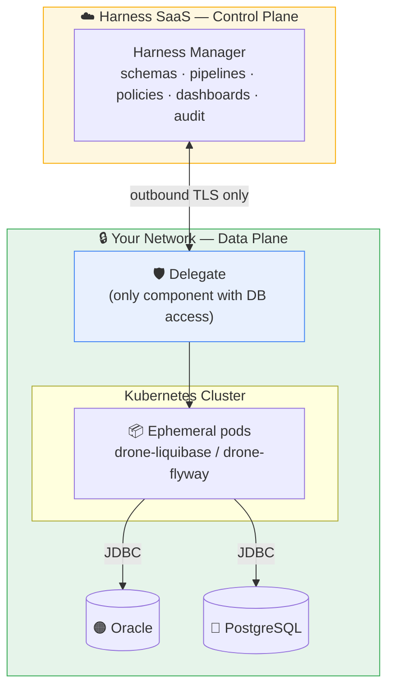
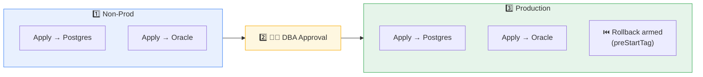

<div align="center">

# 🗄️ Harness Database DevOps
### Bringing CI/CD discipline to the database

**Visa Showcase** · Oracle + PostgreSQL

`Orchestrate` · `Govern` · `Roll back` · `Audit`

</div>

---

## 📌 The one-slide pitch

> You already run **application code** through Harness — build, test, approve, deploy, roll back.
> Your **database** is still changed by hand.
>
> **Harness DB DevOps applies the exact same pipeline discipline to the schema.**

<div align="center">

**Liquibase changes the schema. Harness makes changing the schema _safe, governed, repeatable, and auditable_ — in the same pipeline as the app.**

</div>

---

## 🔴 The problem today

<table>
<tr>
<th>Traditional DB change</th>
<th>With Harness DB DevOps</th>
</tr>
<tr>
<td>

- 📧 SQL scripts emailed to a DBA
- 🖐️ Run manually in a change window
- 📄 Tracked in a spreadsheet
- ❓ No pre-execution safety check
- 💾 Rollback = "restore backup & pray"
- 🕵️ Audit = reconstruct from tickets
- 🐌 DB is the release bottleneck

</td>
<td>

- 🔀 Changelog in Git, reviewed like code
- 🤖 Applied automatically by pipeline
- ✅ Same change applied identically everywhere
- 🛡️ OPA policy blocks bad SQL **before** it runs
- ⏮️ Rollback to a **tagged, known-good** state
- 🧾 Full audit trail: what / who / when / where
- 🚀 DB + app ship in one governed pipeline

</td>
</tr>
</table>

---

## 🧠 The mental model

> **The changelog in Git is the _desired state_ of your schema. Harness makes the database match it — safely.**



**Two things to remember:** it does **not** replace Liquibase/Flyway, and it does **not** move data. It _orchestrates_ the migration — sequence it, govern it, approve it, record it.

---

## 🏛️ Three pillars

<div align="center">

| 🔀 **Orchestrate** | 🛡️ **Govern** | 👁️ **See** |
|:---:|:---:|:---:|
| Version-controlled changelogs | OPA/Rego policy on real SQL | Dashboards per environment |
| Pipeline-native apply/rollback | Approval gates & promotion paths | Drift detection |
| App + DB in one pipeline | Blocks destructive/non-compliant SQL | Full audit trail (SOX/PCI) |

</div>

---

## 🧩 The vocabulary (5 that matter)

| Term | In one line |
|---|---|
| **Changelog** | The schema's version history — an ordered list of changesets (in Git). |
| **Changeset** | One atomic change, identified by `author : id : file`. |
| **DB Schema** *(Harness)* | *What* to change → points at the changelog. |
| **DB Instance** *(Harness)* | *Where* to change → a JDBC connector + Delegate. |
| **DATABASECHANGELOG** | Table Liquibase writes **in your DB** so a change never runs twice. |

> 🔑 Because state lives in the DB's own tracking table and desired state lives in Git, every run is **idempotent** — re-running applies only what's new.

---

## ⚙️ How the "Apply Schema" step works



---

## 🏗️ Architecture — control plane / data plane



✅ **Neither the database nor the cluster needs to be internet-accessible** — the Delegate makes outbound-only calls.
🔐 **Secrets never leave your infrastructure.** Only logs/diffs stream to SaaS for visibility.

---

## 🆚 Harness vs. raw Liquibase / Flyway

| Capability | Liquibase / Flyway alone | ➕ Harness DB DevOps |
|---|:---:|:---:|
| Apply versioned schema changes | ✅ | ✅ |
| Track what's applied | ✅ | ✅ |
| Pipeline-native CI/CD | ❌ | ✅ |
| **OPA policy checks on SQL** | ❌ | ✅ |
| **Approval gates / promotion paths** | ❌ | ✅ |
| **Automated tagged rollback** | ⚠️ manual | ✅ |
| **Drift detection** | ❌ | ✅ |
| **Dashboards & audit trail** | ❌ | ✅ |
| Coordinated app + DB deploy | ❌ | ✅ |

---

## 🐘🟠 Oracle + PostgreSQL — one changelog, two engines

Abstract change types → Liquibase emits **dialect-correct SQL** for each engine.

```yaml
# The SAME createTable definition...
- createTable:
    tableName: account
    columns:
      - column: { name: account_id, type: BIGINT,  autoIncrement: true }
      - column: { name: amount,     type: NUMERIC }
```

| | 🐘 PostgreSQL | 🟠 Oracle |
|---|---|---|
| **JDBC URL** | `jdbc:postgresql://host:5432/db?sslmode=require` | `jdbc:oracle:thin:@//host:1521/service` |
| **Emitted types** | `BIGINT`, `NUMERIC`, `BOOLEAN`, `JSONB` | `NUMBER`, `VARCHAR2`, `GENERATED AS IDENTITY` |
| **Identifiers** | lower-cased unless quoted | upper-cased, historically ≤30 chars |

> ℹ️ Data movement (not schema) is out of scope — use `pg_dump`/Data Pump/DMS for that.

---

## 🔀 The demo pipeline at a glance



Non-prod applies to **both engines in parallel** → DBA sign-off → prod applies the **same** changelogs with **automated `StageRollback`**.

📂 Full YAML: [`harness/db-devops/pipelines/db-devops-oracle-postgres.yaml`](harness/db-devops/pipelines/db-devops-oracle-postgres.yaml)

---

## 🛡️ Governance — the money shot

The Apply Schema step evaluates the **actual SQL** against policy **before touching the DB**:

```rego
deny[msg] {
    db_type := input.db_instances[_].db_type          # "oracle" | "postgresql"
    stmt    := input.sql_statements[_]
    regex.match(".*drop\\s+table.*", lower(stmt.sql))  # 🚫 DROP TABLE
    msg := sprintf("Policy violation: blocked -> %s", [stmt.sql])
}
```

<div align="center">

**A `DROP TABLE` commit → pipeline fails at the policy check → database untouched.**
_The DBA's manual review, automated and enforced on every change, everywhere._

</div>

---

## ⏮️ Rollback — to a known-good state

- The **Apply Schema** step auto-captures a **pre-start tag** before applying changes.
- On failure, a `StageRollback` strategy runs the **Rollback Schema** step back to that tag:

```yaml
tag: <+execution.steps.pg_prod_group.steps.apply_pg_prod.output.preStartTag>
```

> Not "restore a backup and pray" — a precise revert to the last known-good schema.

---

## 👁️ Visibility & audit — built in

- 📊 **Dashboards** — which schema version is where.
- 🔍 **Drift detection** — someone `ALTER`s prod by hand? Harness flags it.
- 🧾 **Audit trail** — SQL applied, approver, timestamp, environment.

<div align="center">

**➡️ This is your SOX / PCI evidence, generated automatically.**

</div>

---

## 🧭 Fit within the Visa blueprint

| Current step | Harness-native target |
|---|---|
| Liquibase (DB) | **Harness DB DevOps** schema apply + DBA approval |

DB DevOps is the **DB track** that runs in parallel with the app track: non-prod apply → change/DBA approval → per-DC prod apply — governed and rollback-armed, across Oracle **and** Postgres.

---

<div align="center">

## ✅ Takeaway

**Orchestrate · Govern · Roll back · Audit**

> Liquibase changes the schema.
> **Harness makes it safe, governed, repeatable, and auditable — in the same pipeline as the app.**

📖 Deep dive: `Harness-DB-DevOps.md` · 🎬 Demo run: `Harness-DB-DevOps-Demo-Script.md` · 📂 Artifacts: `harness/db-devops/`

</div>
