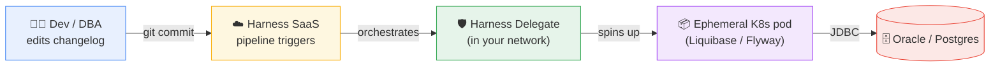
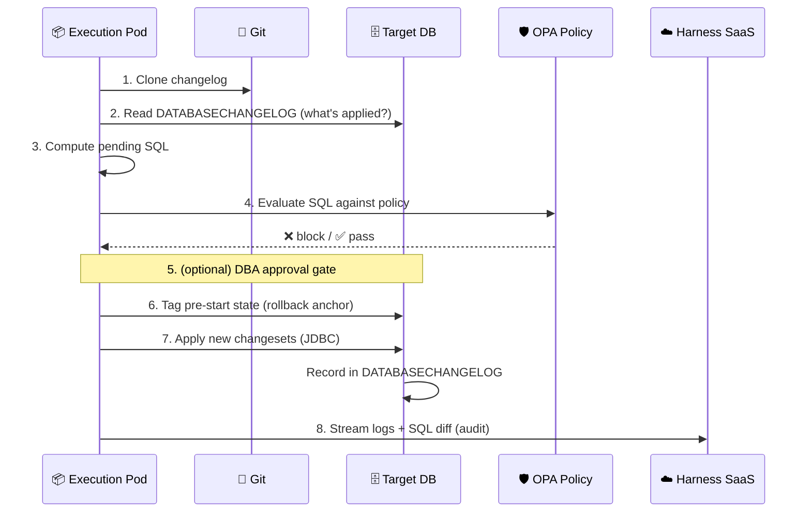
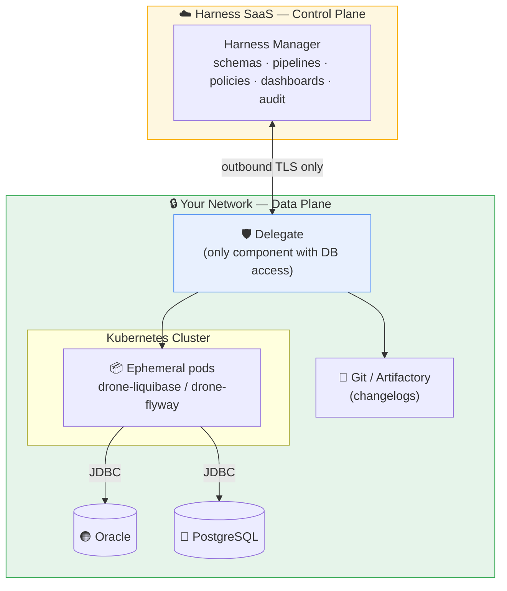
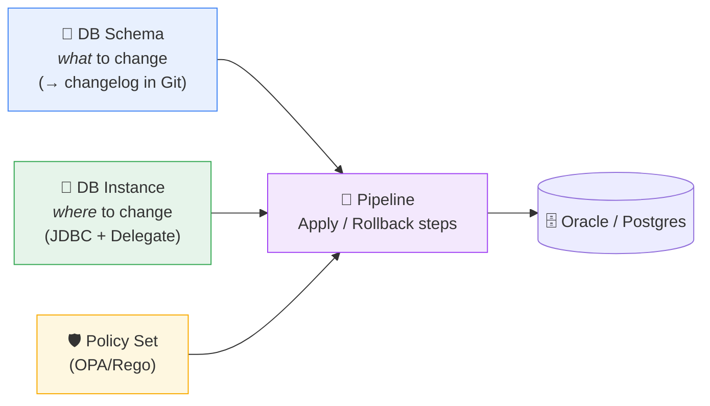
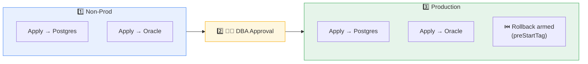
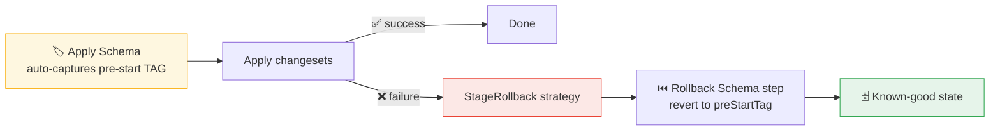

<div align="center">

# 🗄️ Harness Database DevOps
### Bringing CI/CD discipline to the database — end to end

**Oracle + PostgreSQL** · Orchestrate · Govern · Roll back · Audit

</div>

---

## 1. What Harness Database DevOps is

Harness Database DevOps (DB DevOps) brings the same automated, governed pipeline you already use for **application code** to the one thing most teams still change by hand — the **database schema**.

It is a **pipeline-native orchestration layer** built on top of proven open-source migration engines (**Liquibase** and **Flyway**). It does **not** replace those engines and does **not** move data — it *orchestrates* the schema migration: sequences it, governs it, gets it approved, rolls it back, and records it.

**What Harness adds on top of Liquibase/Flyway:**

- 🔀 **Version-controlled schema changes** in Git, reviewed like code.
- 🤖 **Automated, repeatable deployment** across Dev → QA → Prod.
- 🛡️ **Governance** — policy-as-code (OPA/Rego) that blocks destructive or non-compliant SQL *before* it runs.
- 🧑‍⚖️ **Approval gates** — DBA / change sign-off enforced by the pipeline, not by process discipline.
- ⏮️ **Automated rollback** to a tagged, known-good schema state.
- 👁️ **Drift detection, audit trail, and dashboards** — what changed, who approved it, where, and when.
- 🔗 **Coordinated app + database delivery** — schema and application ship in one pipeline.

<div align="center">

**Liquibase changes the schema. Harness makes changing the schema _safe, governed, repeatable, and auditable_ — in the same pipeline as the app.**

</div>

---

## 2. Why it matters — the problem it solves

In most enterprises, application code flows through a governed pipeline while database changes are shipped as SQL scripts, run manually in a change window, and tracked informally. That asymmetry is a leading source of failed and blocked releases. Harness closes the gap.

<table>
<tr>
<th>Traditional DB change</th>
<th>With Harness DB DevOps</th>
</tr>
<tr>
<td>

- 📧 SQL scripts handed to a DBA manually
- 🖐️ Run by hand in a change window
- 📄 Tracked in tickets / spreadsheets
- ❓ No pre-execution safety check
- 💾 Rollback = "restore backup & pray"
- 🕵️ Audit = reconstruct from tickets
- 🐌 Database is the release bottleneck
- ⚠️ Drift discovered during an incident

</td>
<td>

- 🔀 Changelog in Git, reviewed like code
- 🤖 Applied automatically and identically
- ✅ Same change in every environment
- 🛡️ Policy blocks bad SQL **before** it runs
- ⏮️ Rollback to a **tagged, known-good** state
- 🧾 Full audit trail: what / who / when / where
- 🚀 DB + app ship in one governed pipeline
- 🔍 Drift detected and surfaced automatically

</td>
</tr>
</table>

**Business outcomes:** lower change risk, faster releases, consistency across environments and data centers, and audit-ready compliance evidence (SOX / PCI).

---

## 3. Core concepts & terminology

These are the terms used throughout DB DevOps. Most originate from Liquibase; Harness wraps them with governance and delivery.

| Term | Definition |
|---|---|
| **Changelog** | A version-controlled file (YAML/XML/JSON/SQL) that defines how a schema evolves. It is an **ordered list of changesets** — the source of truth for your schema, kept in Git. |
| **Changeset** | A single, atomic change — e.g. *create table*, *add column*, *create index*. Uniquely identified by the tuple **`author : id : filepath`**. |
| **Change Type** | The operation a changeset performs: `createTable`, `addColumn`, `createIndex`, `addForeignKeyConstraint`, raw `sql`, etc. |
| **DB Schema** *(Harness entity)* | Represents **what** to change. Points at your changelog in Git (or Artifactory) and declares the migration type (Liquibase / Flyway). |
| **DB Instance** *(Harness entity)* | Represents **where** to change. A concrete target database defined by a **JDBC connector** (URL + credentials) reached via a **Delegate**. |
| **JDBC Connector** | The connection object: JDBC URL + username + password + which Delegate executes. One per target database. |
| **Migration Type** | `Liquibase Compatible` or `Flyway Compatible` — the engine that executes, chosen per schema. |
| **DATABASECHANGELOG** | Tracking table Liquibase creates **in your database**. Records every applied changeset (`author:id:file` + checksum) so a change is never applied twice. |
| **DATABASECHANGELOGHISTORY** | (Liquibase 4.27+) Additional table logging richer execution metadata/history. |
| **DATABASECHANGELOGLOCK** | Lock table preventing two migrations running against the same DB simultaneously. |
| **Tag** | A named marker of DB state at a point in time. Harness auto-captures a **pre-start tag** before applying, enabling precise rollback. |
| **Context / Labels** | Attributes on a changeset controlling *when/where* it runs (e.g. only in `qa`, or only changesets labelled `payments`). Enables environment-specific execution from one changelog. |
| **Preconditions** | Guards evaluated before a changeset runs (e.g. "only if table does not exist"). |
| **`runInTransaction`** | `true` (default): all statements in a changeset run atomically — any failure rolls the whole changeset back. `false`: each statement commits immediately (for very large migrations). |
| **`runAlways` / `runOnChange`** | `runAlways`: execute on every run. `runOnChange`: re-execute when the changeset's checksum changes. |
| **Apply Schema step** (`DBSchemaApply`) | Pipeline step that runs the migration (Liquibase `update`). |
| **Rollback Schema step** (`DBSchemaRollback`) | Pipeline step that reverts to a given tag or changeset count. |
| **Drift** | Divergence between the schema Harness expects (changelog) and the actual DB state (from out-of-band manual changes). |
| **Delegate** | The Harness worker running inside your network — the secure bridge that reaches the database and orchestrates execution. |

---

## 4. The mental model

> **The changelog in Git is the _desired state_ of your schema. Harness makes the database match it — safely.** (Think "GitOps for your database.")



A change is committed to Git → Harness SaaS triggers the pipeline → the in-network **Delegate** spins up a short-lived Kubernetes pod running the migration engine → that pod applies the change to the database over JDBC. Because the desired state lives in Git and the record of what's applied lives in the database's own tracking table, every run is **idempotent** — re-running applies only what is genuinely new.

---

## 5. Three pillars of the offering

<div align="center">

| 🔀 **Orchestrate** | 🛡️ **Govern** | 👁️ **See** |
|:---:|:---:|:---:|
| Version-controlled changelogs | OPA/Rego policy on the real SQL | Dashboards per environment |
| Pipeline-native apply / rollback | Approval gates & promotion paths | Drift detection |
| App + DB in one pipeline | Blocks destructive / non-compliant SQL | Full audit trail (SOX/PCI) |

</div>

- **Orchestrate** — the CI/CD layer: schema changes are version-controlled and delivered through pipelines, alongside application changes so the two stay in sync.
- **Govern** — the trust layer: policies inspect the actual SQL before execution, approval gates require human sign-off, and promotion paths enforce Dev → QA → Prod order.
- **See** — the visibility layer: dashboards, drift detection, and an automatic audit trail turn every change into compliance evidence.

---

## 6. How it works in Harness — the "Apply Schema" step

When the pipeline's Apply Schema step runs, the short-lived pod performs an ordered, safe sequence:



1. **Clone** the changelog from Git (the source of truth).
2. **Read** `DATABASECHANGELOG` in the target DB to see what is already applied.
3. **Compute** the pending SQL — the exact statements still to run.
4. **Evaluate** that SQL against governance policies; non-compliant SQL fails here, before touching the DB.
5. **Approval** — optionally pause for a DBA / change sign-off.
6. **Tag** the current DB state — the rollback anchor.
7. **Apply** the new changesets over JDBC and record them in `DATABASECHANGELOG`.
8. **Stream** logs and the SQL diff back to Harness for visibility and audit.

The order is the guarantee: **check first, snapshot for rollback, then apply.**

---

## 7. Architecture & how Harness communicates

Harness DB DevOps uses a **control plane / data plane** split. Your database and cluster stay private; only the Delegate talks to Harness, and only outbound.



**Components**

- **Harness Manager (SaaS control plane)** — where you define DB Schemas, DB Instances, pipelines, and policies, and where dashboards, audit, and drift reporting live. It never connects directly to your database.
- **Harness Delegate (in your network)** — the worker that executes. It reaches your Git/artifact repos, the Kubernetes cluster, and the databases. It is the **only** component holding database access.
- **Ephemeral execution pods** — short-lived Kubernetes pods running the migration-engine image. Each DB job runs in its own pod and is torn down after.
- **Target databases** — Oracle, PostgreSQL, and other JDBC-compatible engines.

**How Harness communicates (the trust boundary)**

- The Delegate makes **outbound-only, TLS-encrypted** connections to Harness SaaS. Harness never reaches into your network.
- ✅ **Neither the database nor the Kubernetes cluster needs to be internet-accessible.**
- 🔐 **Secrets stay in your infrastructure** (your secret manager / Vault / cloud KMS), used only by the Delegate.
- Large transient payloads — logs, test results, **schema diffs** — stream directly from the short-lived pods to Harness SaaS over outbound TLS, so the Delegate is not a bottleneck while sensitive data remains within your infrastructure.
- The Kubernetes cluster must have **network reachability to the databases**, and the Delegate must have access to the cluster.

---

## 8. Container images

The Delegate pulls purpose-built engine images to run migrations. Images follow `plugins/drone-liquibase:<x.y.z>-<liquibaseVersion>` (Harness semantic version + engine version).

| Image | Purpose |
|---|---|
| `plugins/drone-liquibase:<x.y.z>-<liquibaseVersion>` | Default Liquibase engine (Oracle, Postgres, MySQL, etc.) |
| `plugins/drone-liquibase:…-mongo` | Liquibase for MongoDB |
| `plugins/drone-liquibase:…-spanner` | Liquibase for Google Spanner |
| `plugins/drone-flyway:<x.y.z>-<flywayVersion>` | Flyway engine |
| `plugins/drone-flyway-mongo:…` / `…-spanner` | Flyway for MongoDB / Spanner |
| `harness/drone-git` | Clone changelog repositories |
| `plugins/download-artifactory` | Pull changelogs / artifacts from Artifactory |

- By default images are pulled anonymously from a **public registry**. For hardened / air-gapped environments you can pull from your **own private registry** or configure credentialed access.
- Default image versions can be **overridden per account** via the `dbops/execution-config` API (get default, get overrides, update, reset, delete).

---

## 9. Setting it up — the Harness entities

Three objects, then a pipeline:



1. **DB Schema** — choose Liquibase/Flyway compatible, point at the Git connector + repo + changelog path.
2. **DB Instance** — create a JDBC connector (URL + credentials) and select the Delegate.
3. **Policy Set** — attach OPA/Rego policies to the DB DevOps steps.
4. **Pipeline** — a Custom stage with a **containerized step group** (Kubernetes infrastructure) containing the **Apply Schema** step; add **Rollback Schema** + a failure strategy.

---

## 10. The delivery pipeline



- **Stage 1 — Non-Prod:** the change is applied to Postgres **and** Oracle in parallel, policy-checked, so problems surface early.
- **Stage 2 — Approval:** the pipeline pauses for a **DBA / change sign-off** and will not touch production until approved.
- **Stage 3 — Production:** the **same** changelogs that passed non-prod are promoted, with **automated rollback** armed — no drift between what was tested and what ships.

```yaml
# The core step — identical shape for Oracle and Postgres
- step:
    type: DBSchemaApply
    name: Apply Postgres Schema
    identifier: apply_pg_prod
    spec:
      connectorRef: account.harnessImage   # engine image source
      migrationType: Liquibase
      dbSchema: payments_pg                 # what
      dbInstance: pg_prod                   # where
      tag: release-<+pipeline.sequenceId>
    timeout: 20m
```

---

## 11. Governance — policy-as-code on the SQL

Harness evaluates the **actual SQL to be applied** against **OPA / Rego policies** *before* execution. Policies receive the SQL and its context (target environment, `db_type` such as `oracle` / `postgresql`) and can `deny` based on rules — the DBA's manual review, codified once and enforced on every change, everywhere.

```rego
deny[msg] {
    db_type := input.db_instances[_].db_type          # "oracle" | "postgresql"
    stmt    := input.sql_statements[_]
    regex.match(".*drop\\s+table.*", lower(stmt.sql))  # 🚫 DROP TABLE
    msg := sprintf("Policy violation: blocked -> %s", [stmt.sql])
}
```

**Typical guardrails**

- Block destructive commands: `DROP TABLE`, `DROP COLUMN`, `TRUNCATE`.
- Forbid Oracle `ALTER SYSTEM` / `ALTER TABLESPACE`, or `CREATE DATABASE` on other engines.
- Enforce naming conventions; require indexes on new foreign keys.
- Restrict grants to `PUBLIC`; pair with RBAC to control who changes which schema.

<div align="center">

**A `DROP TABLE` commit → pipeline fails at the policy check → database untouched.**

</div>

---

## 12. Approvals & promotion paths

Because it is pipeline-native, standard Harness controls sit between environments:

- 🧑‍⚖️ **Manual / DBA approval** step before production (with approver user groups and full execution context shown to the approver).
- ⛓️ **Enforced promotion path** — a change reaches Prod only after passing Dev and QA.
- ❄️ **Freeze windows** — block DB deployments during blackout / peak periods.
- 🔗 **ITSM integration** — tie in ServiceNow / Jira change records where required.

---

## 13. Rollback — to a known-good state



- The Apply Schema step **auto-captures a pre-start tag** — a precise bookmark of the DB state before the change.
- On failure, a `StageRollback` failure strategy runs the **Rollback Schema** step back to that tag, for both Oracle and Postgres.
- Reference the captured tag via expression:

```yaml
tag: <+execution.steps.pg_prod_group.steps.apply_pg_prod.output.preStartTag>
```

> Not "restore a backup and pray" — a surgical, automatic revert of just the schema change to the last known-good state.

---

## 14. Visibility, drift & audit

- 📊 **Dashboards** — which schema version is deployed to which environment; delivery metrics such as lead time.
- 🔍 **Drift detection** — surfaces divergence between the expected (changelog) and actual DB state; if someone `ALTER`s prod by hand, Harness flags it.
- 🧾 **Audit trail** — records every change (SQL applied, approver, timestamp, environment) plus configuration changes to pipelines and policies.

<div align="center">

**➡️ This is your SOX / PCI evidence — generated automatically as a byproduct of doing the work.**

</div>

---

## 15. Harness vs. raw Liquibase / Flyway

| Capability | Liquibase / Flyway alone | ➕ Harness DB DevOps |
|---|:---:|:---:|
| Apply versioned schema changes | ✅ | ✅ (via the same engine) |
| Track what's applied | ✅ (`DATABASECHANGELOG`) | ✅ |
| Pipeline-native CI/CD | ❌ | ✅ |
| **OPA policy checks on SQL** | ❌ | ✅ |
| **Approval gates / promotion paths** | ❌ | ✅ |
| **Automated tagged rollback** | ⚠️ manual | ✅ |
| **Drift detection** | ❌ | ✅ |
| **Dashboards & audit trail** | ❌ | ✅ |
| **RBAC & secret management** | ❌ | ✅ (platform-wide) |
| Coordinated app + DB deploy | ❌ | ✅ (one pipeline) |

**Positioning:** *Liquibase is the engine; Harness is the governed delivery system around it.* You keep the tool your DBAs already trust and wrap it in enterprise controls.

---

## 16. Oracle + PostgreSQL — one changelog, two engines

Abstract Liquibase change types let you describe intent once; the engine emits **dialect-correct SQL** for each database.

```yaml
# The SAME createTable definition...
- createTable:
    tableName: account
    columns:
      - column: { name: account_id, type: BIGINT,  autoIncrement: true }
      - column: { name: amount,     type: NUMERIC }
```

| | 🐘 PostgreSQL | 🟠 Oracle |
|---|---|---|
| **JDBC URL** | `jdbc:postgresql://host:5432/db?sslmode=require` | `jdbc:oracle:thin:@//host:1521/service` |
| **Emitted types** | `BIGINT`, `NUMERIC`, `BOOLEAN`, `JSONB` | `NUMBER`, `VARCHAR2`, `GENERATED AS IDENTITY` |
| **Identifiers** | lower-cased unless quoted | upper-cased; historically ≤ 30 chars |

The database user needs DDL/DML privileges appropriate to the changes (and permission to create the `DATABASECHANGELOG*` tables on first run).

> ℹ️ Data movement (not schema) is out of scope — use `pg_dump` / Oracle Data Pump / cloud DMS for data, and let Harness govern the schema rollout on the target.

---

## 17. Fit within the Visa blueprint

| Current step | Harness-native target |
|---|---|
| Liquibase (DB) | **Harness DB DevOps** schema apply + DBA approval |

DB DevOps is the **DB track** that runs in parallel with the app track: non-prod apply → change / DBA approval → per-DC production apply — governed by policy and armed with rollback, identically across Oracle **and** PostgreSQL. The database stops being the special, manual step that holds up releases and becomes a first-class, automated part of delivery.

---

<div align="center">

## ✅ Takeaway

**Orchestrate · Govern · Roll back · Audit**

> Liquibase changes the schema.
> **Harness makes it safe, governed, repeatable, and auditable — in the same pipeline as the app, across Oracle and Postgres.**

</div>
