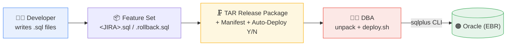
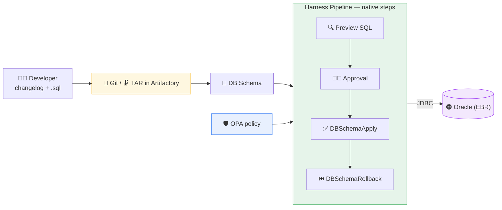
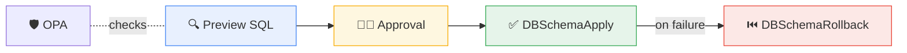
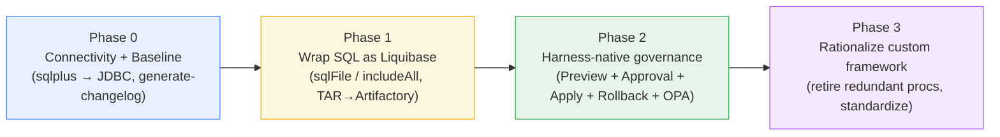

<div align="center">

# 🔄 TMS → Liquibase → Harness DB DevOps
### A fast, low-rework path from the custom sqlplus chain to Harness-native database delivery

**Oracle (EBR)** · sqlplus → JDBC · custom scripts → Liquibase · manual → governed pipeline

</div>

---

## 1. Where TMS is today

TMS does **not** use Liquibase or Flyway. It uses a **custom change-management chain**:

- **Feature Set** — one Jira/GH story = one or more `.sql` files, orchestrated by a `<JIRA>.sql` / `<JIRA>.rollback.sql` template.
- **Executed from the `sqlplus` CLI** — using `START` to run sub-scripts by phase (DEFINE → REGISTER → DDL → PLSQL → GRANTS → COMPILE → COMPLETE → INVALIDS).
- **Custom framework** — generic stored procedures (`maintain_release_prc`, `check_release_prc`) register progress and report invalids; **Edition-Based Redefinition (EBR)** editions and editioning views.
- **Release Package** — many feature sets bundled into a **TAR** (+ Auto-Deploy Y/N + Release Manifest); DBAs unpack and run `deploy.sh`.
- **Connectivity** — the service connects with **`sqlplus` commands, not JDBC**.



It works — but it is manual, sqlplus-bound, hard to govern, and gives no automated preview, policy, drift detection, or centralized audit.

---

## 2. The goal — Harness-native database delivery

Two shifts, done in stages, with **minimal rework** to existing SQL:

1. **Adopt Liquibase** as the change format (Harness runs it for you).
2. **Use Harness-native steps** over **JDBC** — not custom sqlplus shell-outs.



---

## 3. Why native — not "roll-your-own" Option A/B

The team's Option A wraps `sqlplus` inside a Liquibase `<executeCommand>`. That runs on Harness, but it makes the change a **black box**: Harness/Liquibase can't see the SQL, so you lose the very things you're adopting Harness for.

| | ❌ Option A (sqlplus wrapper) | ✅ Harness-native (Liquibase over JDBC) |
|---|---|---|
| Harness sees the real SQL | No — only a bash command | **Yes** |
| **Preview SQL** before apply | No | **Yes** |
| **OPA policy** on the DDL | No | **Yes** |
| **Drift / tamper detection** | Weak (`validCheckSum ANY`) | **Per-changeset checksums** |
| Rollback granularity | Whole feature set | **Per changeset** |
| Failure handling | Manual exit-code plumbing in scripts | **Automatic** — any SQL error fails + rolls back |
| Runtime dependency | Custom image w/ sqlplus + Oracle Net | **None** — pure JDBC |
| Ops complexity | High (TNS, wallet, bash profile in pod) | **Low** |

> **Bottom line:** native is *simpler to operate* (no sqlplus image, no exit-code plumbing) **and** unlocks governance. The wrapper is only a last resort for logic that truly cannot run over JDBC.

---

## 4. The connectivity shift — sqlplus → JDBC

This is the change that matters most, because TMS connects via `sqlplus` today. **`sqlplus` is a client CLI; JDBC is a programmatic connection.** Harness-native steps use JDBC — so the SQL must be "client-command-free."

**What moves from sqlplus to a Harness JDBC DB Instance:**

```
sqlplus LIQUIBASE_DBA/${pwd}@ORA193        →   DB Instance (JDBC connector)
                                               jdbc:oracle:thin:@//host:1521/SERVICE
                                               user + password from a Harness secret
sys as sysdba                              →   user "sys" + URL param internal_logon=sysdba
TNS alias ORA193 / wallet (TCPS)           →   JDBC descriptor or TNS_ADMIN + wallet mount
```

**sqlplus features that must be reworked (client-side, not valid over JDBC):**

| sqlplus construct | Why it fails over JDBC | Native replacement |
|---|---|---|
| `SPOOL`, `SET`, `COLUMN`, `PROMPT` | Client formatting commands | Drop them — Harness captures logs/output |
| `DEFINE` / `&1`, `&&var` substitution | Client-side substitution | Liquibase changelog **`${properties}`** or Harness **pipeline variables** |
| Bind variables `:v_rel`, `VAR … EXEC` | Client bind context | Pass as literals or `${properties}` |
| `EXEC proc(...)` | sqlplus shorthand | Wrap in `BEGIN proc(...); END;` (`splitStatements=false`) |
| `PRINT v_invalids` (refcursor) | No client to print to | Have the proc **RAISE** on invalids, or write results to a table a step queries |
| `WHENEVER SQLERROR EXIT` | — | **Not needed** — Liquibase fails the changeset on any error automatically |
| Multi-statement `.sql` files | JDBC needs statement boundaries | Set `splitStatements` correctly (or split files) |

**What does *not* need to change — reassurance:**

- **EBR is fully supported over JDBC.** `ALTER SESSION SET EDITION = …`, `CURRENT_SCHEMA`, `DDL_LOCK_TIMEOUT`, editioning views, cross-edition triggers — these are ordinary SQL/DDL. Put the `ALTER SESSION` lines at the top of each changeset; they apply to that JDBC session.
- **Your PL/SQL and stored-proc calls still work** — just expressed as `<sql splitStatements="false">BEGIN … END;</sql>` blocks.
- **Your existing `.sql` DDL is reused** — referenced via `<sqlFile>` (see §5), not rewritten.

---

## 5. Getting to Liquibase quickly (the low-rework on-ramp)

You do **not** rewrite your SQL. Two moves get you onto Liquibase fast:

**(a) Baseline the current schema.** Use Harness's **Liquibase Command step → `generate-changelog`** to capture the existing database as a starting changelog, and mark it as already-applied so Harness/Liquibase begins from your real state (no attempt to re-create existing objects).

**(b) Wrap existing SQL, don't rewrite it.** Keep your `.sql` files (stripped of sqlplus client commands per §4) and reference them from a thin changelog:

```xml
<!-- One changeSet per SQL file — reuses your existing DDL as-is -->
<changeSet id="SPCDB-9999:ddl:CREATE_LBPOC_NEW_TBL" author="developer" runInTransaction="false">
  <sql>ALTER SESSION SET CURRENT_SCHEMA = xtestx</sql>
  <sql>ALTER SESSION SET EDITION = XTESTX_EDITION_70</sql>
  <sqlFile path="sql/ddl/SPCDB-9999-CREATE_LBPOC_NEW_TBL.sql"
           splitStatements="false" stripComments="false"/>
  <rollback>
    <sql>DROP TABLE xtestx.lbpoc_new_tbl PURGE</sql>
  </rollback>
</changeSet>
```

Or, closest to your current "folder of ordered SQL" model, use **`includeAll`** to pull a whole directory:

```yaml
databaseChangeLog:
  - includeAll:
      path: sql/ddl        # runs files in order — minimal restructuring
```

**Your TAR packaging is preserved.** Point a Harness **DB Schema** at the **Artifactory archive (TAR)** and give the path to the master changelog inside it — Harness extracts and applies it. Release Manifest → the master changelog's include order; `deploy.sh` → the pipeline; Auto-Deploy=N → a manual approval gate.

---

## 6. Adopt the Harness-native steps

Once changes are Liquibase changelogs over JDBC, assemble the governed pipeline from **native steps** (no custom shell-outs):

| Native step | Role |
|---|---|
| **Liquibase Command** (`status`, `generate-changelog`, `diff-log`, `release-locks`) | Baseline, inspect pending changes, recover locks |
| **Preview SQL** | Show the exact SQL that will run (your old `status`/dry-run, now visible in-pipeline) |
| **Approval** | DBA / change sign-off gate before prod |
| **DBSchemaApply** | `liquibase update` — applies pending changesets, tracks in `DATABASECHANGELOG` |
| **DBSchemaRollback** | Revert to a tag / count using each changeset's `<rollback>` |
| **OPA policy** | Block destructive / non-compliant SQL before it runs |



---

## 7. What happens to the custom framework (EBR + release procs)

- **Keep initially:** express `maintain_release_prc` (REGISTER/COMPLETE) and `check_release_prc` as PL/SQL `<sql>` changesets at the start/end — behavior preserved, now over JDBC.
- **Then rationalize:** Harness + `DATABASECHANGELOG` already provide applied-state tracking, audit, approver, and timestamps — so parts of the custom progress-tracking become **redundant**. Keep only what serves an application purpose (e.g. an internal release registry); retire the rest.
- **Invalids:** replace `PRINT v_invalids` with the proc **raising an error** when invalids exist (fails the changeset) and/or a **Preview/verify** step that surfaces them — better than the current print-and-continue.

---

## 8. Phased transition roadmap



| Phase | Focus | Outcome |
|---|---|---|
| **0 — Connectivity & baseline** (1–2 wks) | Stand up a **JDBC DB Instance**; prove connectivity through the Delegate; `generate-changelog` to baseline current schema | Off sqlplus for connection; a known starting point |
| **1 — Wrap SQL as Liquibase** (2–4 wks) | Strip sqlplus client commands; reference `.sql` via `sqlFile`/`includeAll`; deliver via **TAR → Artifactory archive** | On Liquibase with minimal rework; TAR model intact |
| **2 — Native governance** (3–4 wks) | Assemble Preview SQL + Approval + DBSchemaApply + DBSchemaRollback; add **OPA**, env promotion, secrets, dashboards | Governed, auditable, automated delivery |
| **3 — Rationalize** (ongoing) | Retire redundant custom procs; standardize changelog authoring; deprecate the sqlplus chain | Clean, native steady state |

---

## 9. What changes for the team

- **Developers:** author a small changelog per feature set and keep writing `.sql` (minus sqlplus client commands). IDs stay stable so tracking is consistent.
- **DBAs:** stop hand-running `deploy.sh`; instead **review Preview SQL and approve** in the pipeline. Same authority, less toil, full audit.
- **Ops:** no custom sqlplus image, no TNS/wallet gymnastics in the runner — just a JDBC connector and a Delegate with network access.

---

## 10. Risks & mitigations

| Risk | Mitigation |
|---|---|
| sqlplus-only constructs (bind vars, DEFINE, PRINT) | Map to `${properties}` / PL/SQL / RAISE per §4; catalog them up front |
| EBR concerns over JDBC | Proven pattern — `ALTER SESSION SET EDITION` per changeset; validate in Phase 0 |
| "Too much rework" objection | `includeAll` + `sqlFile` reuse existing SQL; `generate-changelog` baselines fast |
| Multi-statement files | Set `splitStatements` correctly; split only where necessary |
| Losing the release registry | Keep the procs as PL/SQL changesets until Harness tracking is accepted as the source of truth |

---

<div align="center">

## ✅ Takeaway

**Move the connection sqlplus → JDBC, wrap existing SQL as Liquibase (don't rewrite it), and drive it with Harness-native steps.**

> Quick on-ramp, no black-box wrappers, full governance — and EBR, PL/SQL, and your TAR packaging all come along for the ride.

</div>
