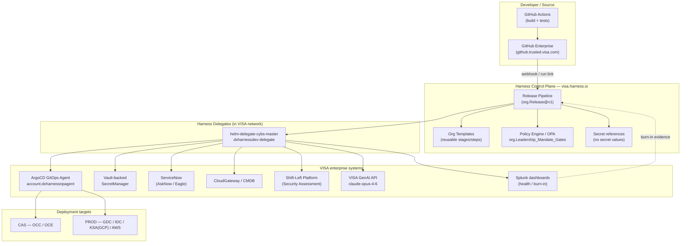
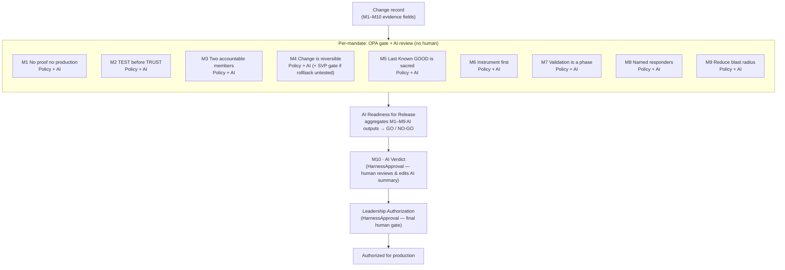
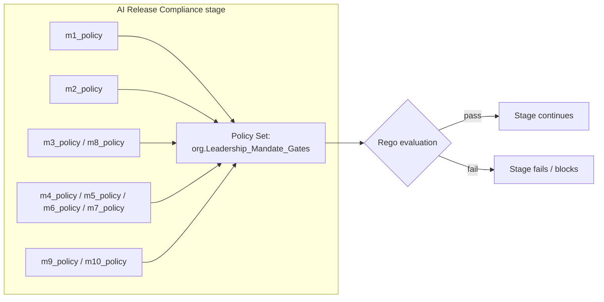
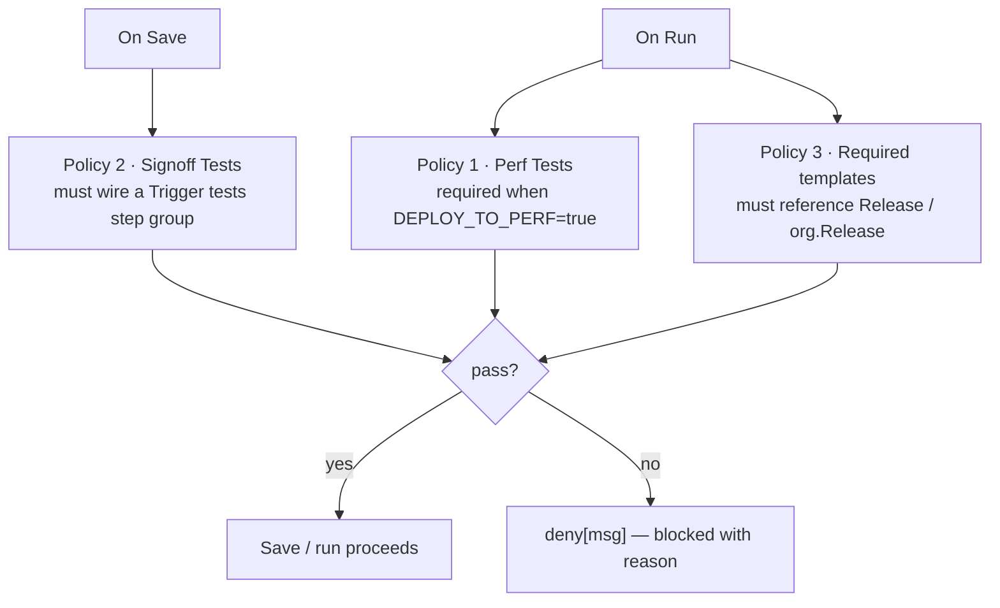
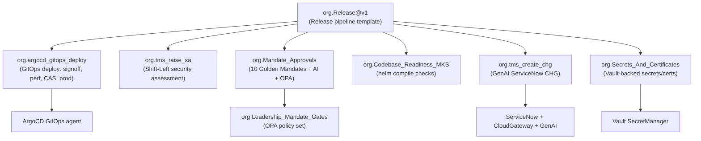

# Harness at VISA — Onsite Architecture & Benefits

**Scope:** VAS / TMS Third-Party Gateway release automation
**Org:** `VAS`  ·  **Project:** `VISA_0018332`  ·  **Pipeline template:** `org.Release@v1`
**Context:** Output of the two-week Harness + VISA onsite. This document explains what
was built, how it is wired together, and — in VISA terms — why it matters.

---

## 1. Executive summary

During the onsite the team turned the TMS release process into a **single,
template-driven Harness pipeline** that carries a change from a GitHub Actions build all
the way to a phased, multi-datacentre production rollout — with governance, security
assessment, ServiceNow change creation, and AI review **built into the pipeline** rather
than run as side conversations.

Three things make this materially different from a conventional CD pipeline:

1. **Everything is a reusable Org template.** The `Release` pipeline is an *assembly* of
   shared building blocks (`org.argocd_gitops_deploy`, `org.tms_raise_sa`,
   `org.tms_create_chg`, `org.Mandate_Approvals`, `org.Codebase_Readiness_MKS`,
   `org.Secrets_And_Certificates`). Fix once, and every service that adopts the template
   inherits the fix.
2. **Governance is enforced by OPA, not by trust.** The 10 VISA Golden Mandates are
   evaluated by the Harness Policy Engine (`org.Leadership_Mandate_Gates`) as hard gates.
   A change cannot advance if the mandate evidence is missing.
3. **AI does the first-pass review with no human in the loop.** Every mandate is
   independently scored by VISA's internal GenAI (`claude-opus-4-6` via the Visa GenAI
   API), and an aggregate **GO / NO-GO** verdict is produced automatically before any
   human is asked to authorize.

The net effect: a release that used to depend on people remembering to attach evidence,
raise the SA, cut the CHG, and chase approvals now runs as **one auditable, self-governing
pipeline** — while humans stay firmly in control of the final production authorization.

---

## 2. Platform architecture

Harness is the control plane. It orchestrates the existing VISA estate (GitHub Enterprise,
ArgoCD/GitOps, Vault, ServiceNow, CloudGateway/CMDB, the Shift-Left Platform, Splunk, and
the internal GenAI service) through delegates running inside the VISA network.

**Why this matters for VISA:** one control plane, one audit trail. Every integration point
(SA, CHG, secrets, deploy, monitoring) is reached through a governed delegate with
secret-managed credentials, so there is no tool sprawl and no place for a release to
"fall out" of the tracked process.

---

## 3. The Release pipeline, end to end

The `org.Release` template chains the release as a sequence of stages, using parallel
blocks wherever work is independent. Below is the real execution order.

```mermaid
flowchart TD
    A["1 · Resolve GHA Run Logs\n(pull GitHub Actions job logs)"] --> B

    subgraph B["2 · Signoff / Perf / SA (parallel)"]
        B1["Signoff Deploy\norg.argocd_gitops_deploy"]
        B2["Perf Deploy\n(conditional: DEPLOY_TO_PERF)"]
        B3["Raise SA\norg.tms_raise_sa (Shift-Left Platform)"]
    end

    B --> C
    subgraph C["3 · Tests (parallel)"]
        C1["Signoff Tests\n(trigger GH workflow, mirror result)"]
        C2["Perf Tests\n(Jenkins build)"]
    end

    C --> D
    subgraph D["4 · Readiness + AI Compliance (parallel)"]
        D1["Codebase Readiness\norg.Codebase_Readiness_MKS"]
        D2["AI Release Compliance\norg.Mandate_Approvals — 10 mandates"]
    end

    D --> E["5 · Schedule Release\norg.tms_create_chg (ServiceNow CHG)"]

    E --> F
    subgraph F["6 · Secrets + DB (parallel)"]
        F1["Secrets & Certificates\norg.Secrets_And_Certificates (Vault)"]
        F2["DB Release (approval gate)"]
    end

    F --> G["7 · Delphinus Feature Toggle"]

    G --> H
    subgraph H["8 · CAS deploy (parallel)"]
        H1["Deploy CAS — OCC"]
        H2["Deploy CAS — OCE"]
    end

    H --> I["9 · Monitoring & Burn-In\n(HarnessApproval — PRE sign-off)"]

    I --> J
    subgraph J["10 · PROD fan-out (parallel, per DC)"]
        J1["GDC — OCC / OCE\n(gate → sync per DC)"]
        J2["IDC — OCIM / OCIB\n(gate → sync per DC)"]
        J3["KSA / GCP"]
        J4["AWS"]
    end

    J --> K["Notifications on failure\n(GDLTMSOuterLoop@visa.com)"]
```

### Stage-by-stage intent

| # | Stage | Backing template | What it does | VISA benefit |
|---|-------|------------------|--------------|--------------|
| 1 | Resolve GHA Run Logs | inline `Custom` | Resolves a GitHub Actions run link and pulls each job's logs into the Harness console | Build evidence lives next to the release, not in a separate tab |
| 2 | Signoff / Perf Deploy | `org.argocd_gitops_deploy` | GitOps deploy to lower environments via ArgoCD (`GitOpsUpdateReleaseRepo → create_argo_release → MergePR → GitOpsSync`) with a pre-req version gate | One proven deploy pattern reused across every environment and DC |
| 2 | Raise SA | `org.tms_raise_sa` | Automatically raises and polls the **Security Assessment** in the Shift-Left Platform | Removes a manual, easy-to-forget compliance step |
| 3 | Signoff / Perf Tests | inline `Custom` | Triggers GitHub Actions / Jenkins tests and mirrors their pass/fail back into the gate | Test outcome becomes an enforced gate, not a courtesy check |
| 4 | Codebase Readiness | `org.Codebase_Readiness_MKS` | Helm-chart compile checks for CAS and PROD | Catches packaging failures before the change window |
| 4 | AI Release Compliance | `org.Mandate_Approvals` | The 10 Golden Mandates: OPA policy + AI evaluation per mandate (see §4) | Governance + first-pass review with **no human in the loop** |
| 5 | Schedule Release | `org.tms_create_chg` | CMDB lookup + GenAI-authored ServiceNow CHG content, human review, then native `ServiceNowCreate` | The CHG writes itself; a human edits and approves |
| 6 | Secrets & Certificates | `org.Secrets_And_Certificates` | Stages Vault-backed secrets/certs ahead of the window | Decoupled, no last-minute secret scramble |
| 6 | DB Release | inline `Approval` | Explicit blocking gate for DB coordination | Keeps DB change in lockstep with app change |
| 7 | Delphinus Feature Toggle | inline `Custom` | Feature-flag hook point | Flag flips are part of the tracked release |
| 8 | Deploy CAS OCC/OCE | `org.argocd_gitops_deploy` | First real production surface (CAS) | Canary-style first blast before global PROD |
| 9 | Monitoring & Burn-In | inline `Approval` | PRE approves PROD fan-out only after a clean CAS burn-in | Human gate backed by real telemetry |
| 10 | PROD GDC / IDC / KSA / AWS | per-DC stages | Phased, gated deploy per datacentre | Blast radius stays small; each DC is its own gate |

**Notifications** are wired per failure class (PROD deploy, CAS deploy, lower-env test,
lower-env deploy) to `GDLTMSOuterLoop@visa.com`, so the right people are alerted without
watching the console.

---

## 4. No-human-intervention AI analysis (the 10 Golden Mandates)

This is the centrepiece of the onsite. The **AI Release Compliance** stage
(`org.Mandate_Approvals`) encodes VISA's **10 Golden Mandates of change** as a two-layer
check on every mandate:

1. **OPA policy gate** — a `Policy` step evaluates the mandate payload against the
   `org.Leadership_Mandate_Gates` policy set. This is the hard, deterministic gate.
2. **AI evaluation** — a `ShellScript` step calls the VISA GenAI API
   (`claude-opus-4-6`, app `change-creation-automation`) with a mandate-specific system
   prompt and the change evidence, returning a structured `ai_output`. **No human is
   involved in this pass.**

At the end, a **single aggregate AI step** (`AI Readiness for Release`) reads *all* the
per-mandate AI outputs and produces one **GO / NO-GO** recommendation. Only then are
humans asked to authorize.

### The mandates and their evidence

| Mandate | Name | Enforced evidence |
|---------|------|-------------------|
| M1 | No proof, no production | Why necessary, problem & size, why it can't wait, risk introduced |
| M2 | TEST before TRUST | Test plan attached + executed, tester, date, result, attestation |
| M3 | Two accountable members | PD change owner **and** an independent verifier (must differ) |
| M4 | Change is reversible | Rollback documented, sequence/time, tested, decision threshold |
| M5 | Last Known GOOD is sacred | Explicit last-known-good version / config / data state |
| M6 | Instrument first | Health indicators + success metrics available |
| M7 | Validation is a phase | Owners for 0–60 min, 60 min–24 hr, and business-cycle validation |
| M8 | Named responders | Named technical, business, and escalation leads |
| M9 | Reduce blast radius | Strategy (Canary / PhasedRollout / FeatureFlags / …) + how |
| M10 | AI review & validation | Record is AI+human-review ready; aggregate GO/NO-GO verdict |

### The human safety valves (by design)

Automation does the *work*; humans keep the *authority*:

- **M4 SVP exception gate** — if `m4_rollback_tested == "No"`, a dedicated `HarnessApproval`
  requiring SVP sign-off is triggered *conditionally*. Untested rollback cannot slip through.
- **M10 AI Verdict** — the aggregated AI summary is pre-filled into an approval form; a
  human reviews and can **edit any field** before it moves on.
- **Leadership Authorization** — a final, explicit human gate authorizes production.

**VISA benefit:** the mandates stop being a wiki checklist people fill in from memory. They
become **machine-checked evidence** (OPA) plus a **consistent AI opinion** on every field —
so humans spend their time on judgement, not on chasing whether the boxes were ticked.

---

## 5. OPA policy governance

The `org.Leadership_Mandate_Gates` policy set is referenced by every mandate's `Policy`
step. This is Harness **Policy-as-Code (OPA/Rego)** doing the deterministic enforcement
layer underneath the AI opinion.

Governance operates at two levels here:

- **In-pipeline mandate gates** — each `Policy` step submits a small JSON payload
  (`{"mandate": "1", "why_necessary": "...", ...}`) and the policy set decides pass/fail.
- **Platform-level pipeline governance** — the Harness governance hooks evaluate pipeline
  YAML on create/update, so template reuse and policy compliance are checked as pipelines
  themselves change.

### 5.1 Release-pipeline shape policies (Rego)

Beyond the mandate gates, the onsite produced **three Rego policies that enforce the
*shape* of any `release-*` pipeline** — i.e. they guarantee that release pipelines are
built the right way *before* they are ever allowed to save or run. All three key off the
same convention: a pipeline is a "release" pipeline when its `name` **or** `identifier`
starts with `release-`. They differ in *what* they enforce and *when* they fire.

| # | Policy | Event | What it guarantees | Deny reason(s) |
|---|--------|-------|--------------------|----------------|
| 1 | **Perf test enforcement** | `onrun` | When the `DEPLOY_TO_PERF` variable **resolves to `true`**, the release pipeline must have a `Perf Test(s)` Custom stage that contains a step group referencing **Trigger Github Tests** or **Trigger Jenkins Tests** | (A) `DEPLOY_TO_PERF=true` but no Perf Test stage at all; (B) Perf stage exists but has no trigger-tests step group |
| 2 | **Signoff tests enforcement** | `onsave` | Every release pipeline's `Signoff Tests` Custom stage must contain a step group referencing **Trigger Github Tests** or **Trigger Jenkins Tests** | Signoff Tests stage present but missing the trigger-tests step group |
| 3 | **Required templates** | `onrun` | Every release pipeline must reference the required templates `["Release", "org.Release"]` somewhere in its tree | Pipeline is a release pipeline but does not reference a required template |

**Why the design is robust (worth calling out to leadership):**

- **Save-time vs run-time split.** Policy 2 fires **on save** — the structural rule that
  every release must run its signoff tests is checked the moment the author writes the
  pipeline, so bad structure never reaches Git. Policies 1 and 3 fire **on run**, because
  they depend on *resolved* runtime values (`DEPLOY_TO_PERF`'s actual value, and the fully
  expanded template tree). This is exactly the right use of Harness's On Save / On Run
  policy hooks.
- **Conditional enforcement.** Policy 1 only demands a Perf Test stage *when performance
  deployment is actually turned on* (`DEPLOY_TO_PERF=true`) — it never blocks a release
  that legitimately skips perf. The truthiness check is normalised (`is_true` lower-cases
  and stringifies), so `"true"`, `true`, and `TRUE` are all handled.
- **Deep, layout-agnostic matching.** All three use Rego `walk()` to search the *entire*
  execution tree — sequential stages, `parallel` blocks, step groups, and `insert` nodes
  alike — so a required step group is found no matter how the author nested it. Stage
  names are matched case-insensitively.
- **Scope-agnostic template matching.** The `templateRef` regexes match by **suffix**, so
  `Trigger Github Tests` is recognised whether it is referenced as `account.…`, `org.…`,
  or `project.…` scoped. The name regexes also tolerate spacing/underscore variants
  (`trigger[_ ]*git[ ]*hub[_ ]*tests$`).
- **Actionable failures.** Each rule emits a `deny[msg]` with the offending stage and
  pipeline name, so the author sees *exactly* what to fix rather than a generic block.

**VISA benefit:** these three policies make the "golden" release shape **non-optional**.
A `release-*` pipeline physically cannot save without its signoff tests wired, cannot run
without the approved `Release` template, and cannot run a perf deployment without proving
its perf tests exist. Combined with the mandate gates in §4, VISA gets *structural*
governance (is the pipeline built correctly?) on top of *evidentiary* governance (does the
change meet the 10 mandates?).

**Recommended hardening** (natural next steps, consistent with the earlier golden-pipeline
review):

- Roll new policy rules out **warning → error** so teams adapt before enforcement bites.
- Keep policy sets at **org scope** so every VAS project inherits the same mandate bar.
- Version the Rego alongside the templates in Git for full change history.

Docs: [Policy-as-Code overview](https://developer.harness.io/docs/platform/governance/policy-as-code/harness-governance-overview/) ·
[sample use cases](https://developer.harness.io/docs/platform/governance/policy-as-code/sample-policy-use-case/)

---

## 6. Template reuse map

The single biggest maturity signal in this build is that the pipeline is an *assembly of
Org templates*, not a copy-pasted monolith. One improvement to a template propagates to
every service and every DC that consumes it.

| Template | Reused by | Change-once effect |
|----------|-----------|--------------------|
| `org.argocd_gitops_deploy` | Signoff Deploy, Perf Deploy, CAS OCC/OCE, PROD | Deploy logic fixed once applies to every environment and datacentre |
| `org.tms_raise_sa` | Raise SA | SA field/API changes handled in one place |
| `org.Mandate_Approvals` | AI Release Compliance | Mandate wording, prompts, and gates evolve centrally |
| `org.tms_create_chg` | Schedule Release | CHG content generation + CMDB mapping maintained once |
| `org.Codebase_Readiness_MKS` | Codebase Readiness | Readiness checks standardised across services |
| `org.Secrets_And_Certificates` | Secrets & Certificates | Secret staging pattern shared org-wide |

---

## 7. Benefits scorecard — in VISA terms

| Theme | Before (typical) | With this Harness pipeline |
|-------|------------------|----------------------------|
| **Control plane** | GitHub, Jenkins, ArgoCD, ServiceNow, SLP driven separately | One orchestrated, auditable flow in Harness |
| **Reuse** | Per-service copy-paste pipelines | Org templates; fix once, applies everywhere |
| **Governance** | Mandate checklist filled by hand | OPA policy gates enforce the 10 mandates |
| **Review** | Human reads every change record cold | AI scores every mandate first; humans review the summary |
| **Security (SA)** | Manual raise + chase | `org.tms_raise_sa` raises and polls automatically |
| **Change record (CHG)** | Hand-written in ServiceNow | GenAI drafts; human edits; native `ServiceNowCreate` files it |
| **Secrets** | Last-minute, manual | Vault-backed, staged ahead of the window |
| **Rollout** | Broad, risky prod pushes | CAS burn-in → per-DC gated fan-out (small blast radius) |
| **Rollback** | Ad hoc | Documented, tested, threshold-driven; untested rollback needs SVP |
| **Evidence** | Scattered across tools | Attached to the execution; one audit trail |
| **Alerting** | Watch the console | Failure-class notifications to the outer-loop DL |

### Where humans stay in charge

This is deliberately **not** a "push button, no oversight" system. Automation removes toil;
humans still own the decisions at four points: **Signoff Deploy approval**, the **M4 SVP
rollback exception**, the **M10 AI Verdict** (review + edit the AI summary), the
**Leadership Authorization**, and the **Monitoring & Burn-In** PRE sign-off before PROD.

---

## 8. Recommended next steps

1. **Promote policy rules warning → error** on `org.Leadership_Mandate_Gates`, then widen
   to more VAS projects.
2. **Replace the remaining placeholders** (Mandate 2/5 "Fetch from Visa systems"
   ShellScripts) with the real Visa API calls now that the pattern is proven.
3. **Move the CA bundle off `-k`** in the GenAI/CloudGateway calls (`--cacert <visa CA>`)
   for full TLS verification on the delegate.
4. **Matrix the per-DC PROD stages** so adding a datacentre is a config line, not a new
   stage — and replace the PROD deploy *stubs* with the real `org.argocd_gitops_deploy`
   pattern once Deployment-type stages are approved inside the fan-out.
5. **Keep the Release pipeline itself in Git** (GitX) alongside the templates, routed
   through PR review, so pipeline logic gets the same audit trail as application code.

Docs: [Templates best practices](https://developer.harness.io/docs/platform/templates/template-best-practices/) ·
[Git Experience](https://developer.harness.io/docs/platform/git-experience/git-experience-overview) ·
[Approvals](https://developer.harness.io/docs/platform/approvals/adding-harness-approval-stages/)

---

*Diagrams above are Mermaid; they render in GitHub, most Markdown viewers, and Confluence
(with a Mermaid macro). Ask if you'd like this exported to `.docx`/`.pdf` alongside the
existing `golden_pipeline_vm_review` artifacts, or rendered as an interactive canvas.*
